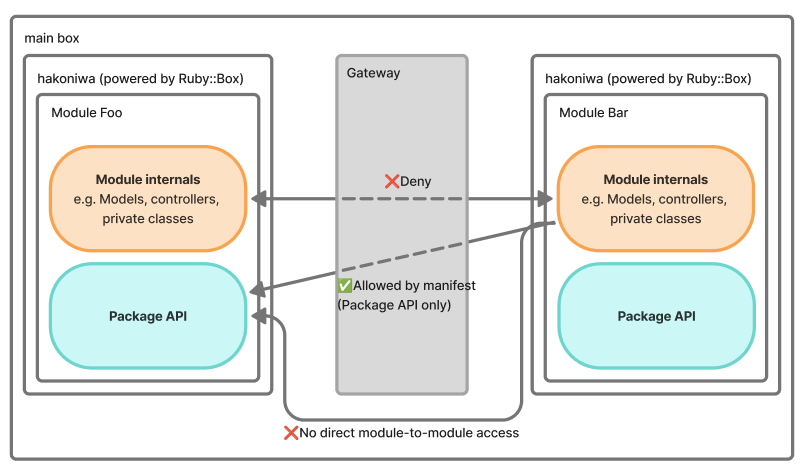

# torikago

`torikago`は、Railsのmodular monolithでmoduleごとの実行境界を扱うためのgemです。`packwerk`や`Rails::Engine`で構造上の境界を作るだけでなく、`Ruby::Box`を使って実行時の境界も強くすることを目指しています。

`torikago`では、module間の呼び出しを`Torikago::Gateway.call(...)`に集約し、各moduleのPackage APIと呼び出し可能なmoduleを事前に定義します。これによって、意図していないmodule間参照を実行時に防ぎやすくします。



## 設定例

Rails app側でmoduleを登録します。

```ruby
Torikago.configure do |config|
  config.register(
    :foo,
    root: Rails.root.join("modules/foo"),
    entrypoint: "app/package_api",    # optional
    setup: "config/box_setup.rb",     # optional
    gemfile: "Gemfile"                # optional
  )
end
```

`config.register`で指定できる主な項目は次のとおりです。

- `root`
  - moduleのルートディレクトリ
- `entrypoint`
  - public APIを探索するディレクトリ、またはその配下のファイル
  - 未指定時は`app/package_api`
- `setup`
  - Box boot前に読み込むsetup hook
  - monkey patchやbox固有の初期化処理に使う
- `gemfile`
  - そのBoxで優先したいgem require pathを解決するためのGemfile
  - Box cold boot時に、解決したrequire pathをそのBoxの`load_path`先頭側へ追加する
  - main box側のgem activationに頼らず、module codeからmodule-localなgem versionを`require`できるようにするための設定

module側では、公開するPackage APIと、どのmoduleから呼べるかを定義します。

```yaml
exports:
  Foo::ListProductsQuery:
    allowed_callers:
      - baz
```

module自身からの呼び出しとmain boxからの呼び出しは許可されます。`allowed_callers`は、他moduleからの参照だけを制限します。

呼び出し側では、対象のclass名を使って呼び出します。

```ruby
Torikago::Gateway.call("Foo::ListProductsQuery")

# 引数を渡す場合
Torikago::Gateway.call("Bar::SubmitOrderCommand", title: "Book")
```

`Torikago::Gateway.call(...)`は、class名から対象moduleを解決し、そのmoduleのexportされたPackage API定義を確認したうえで、対象Boxの中で`new.call(...)`を実行します。

## Example app

`example/rails-modular-monolith/`に、最小のRails example appが入っています。

## 使い方

### gem本体のテスト

```sh
bundle exec rake test
```

### example appのテスト

```sh
cd example/rails-modular-monolith
RUBY_BOX=1 bundle exec rails test
```

### example appの起動

```sh
cd example/rails-modular-monolith
RUBY_BOX=1 bundle exec rails s
```

`Ruby::Box`を実際に有効にするには`RUBY_BOX=1`が必要です。

## CLI

`exe/torikago`からCLIを利用できます。

```sh
bundle exec ruby exe/torikago --help
```

主なコマンド:

- `torikago init`
  - 対話式で`package_api.yml`と`config/initializers/torikago.rb`を生成する
- `torikago check`
  - `Gateway.call`とmanifestの整合性を検証する
- `torikago update-package-api [BOX]`
  - 設定済みentrypointから`package_api.yml`を更新する

`torikago check`は、`Torikago::Gateway.call("...")`の呼び出しを走査し、

- manifestにそのclassが定義されているか
- 呼び出し元moduleが`allowed_callers`に含まれているか
- manifest上のclassに対応するファイルが存在するか

を確認します。

## `RUBY_BOX=1`とbootについて

現状のexample appでは、`RUBY_BOX=1`下でRails bootを安定させるために、いくつか回避策を入れています。

- Bundler pluginを無効化する
- `tmpdir`を早めに読み込む
- `RUBY_BOX=1`時は`Bundler.require(*Rails.groups)`を避け、必要なgemを明示的に`require`する

これらは`torikago`の最終形というより、現時点でexampleを安定して動かすための実務的なworkaroundです。

## 現時点の制約

- 初回のBox bootは重い
  - cold boot時は数秒オーダーのコストが出ることがある
- `Ruby::Box`自体がexperimental
  - segfaultや不安定さに遭遇することがある
- Railsや一部gemとの相性問題がある
  - とくにVM全体へ影響するglobal-effect gemは、きれいに分離しきれない
- full `Rails::Engine` confinementを素直にやるのはまだ難しい

代表的な例外:

- `Torikago::DependencyError`
  - 許可されていないmodule間参照
- `Torikago::PublicApiError`
  - manifestに宣言されていないPackage APIの呼び出し
- `Torikago::GemfileOverrideError`
  - Box用Gemfileの解決やactivateに失敗したとき

そのため、現時点の`torikago`は「すぐ本番導入できる完成品」というより、modular monolithの実行境界をどこまで強くできるかを探る実装です。
